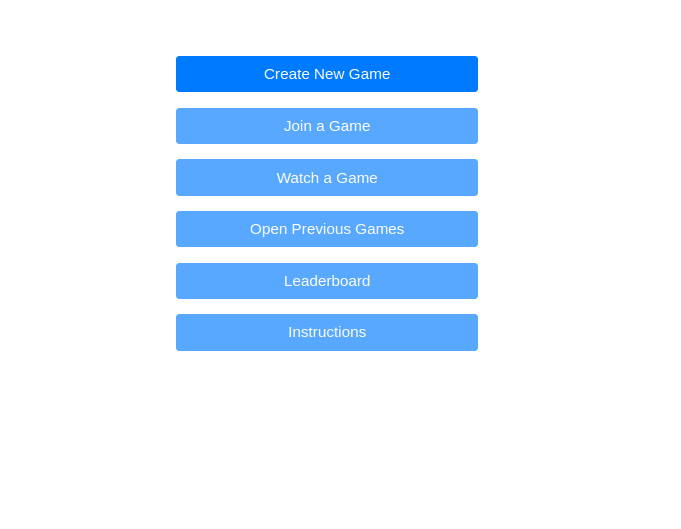
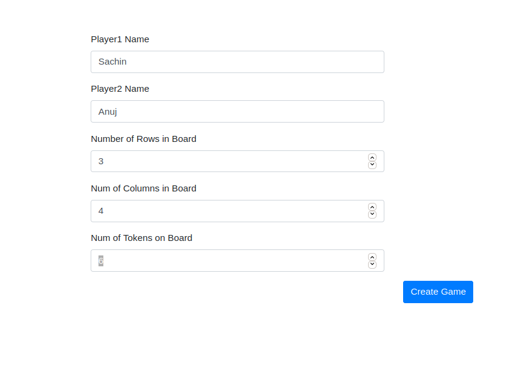
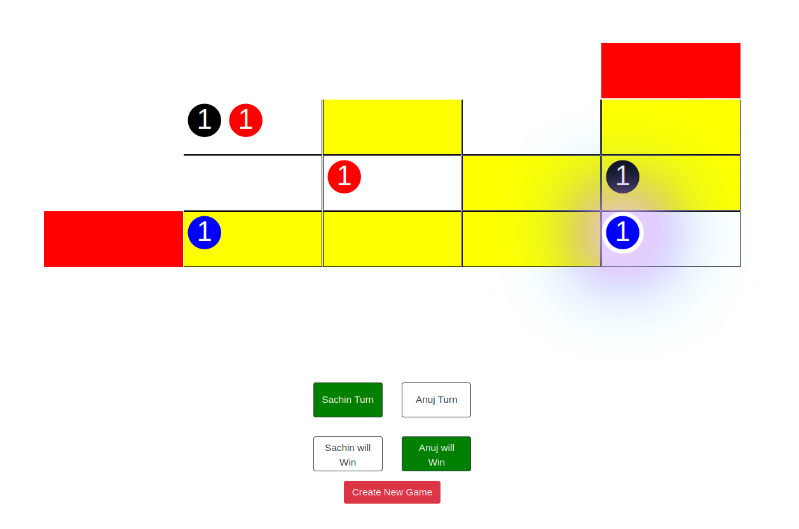
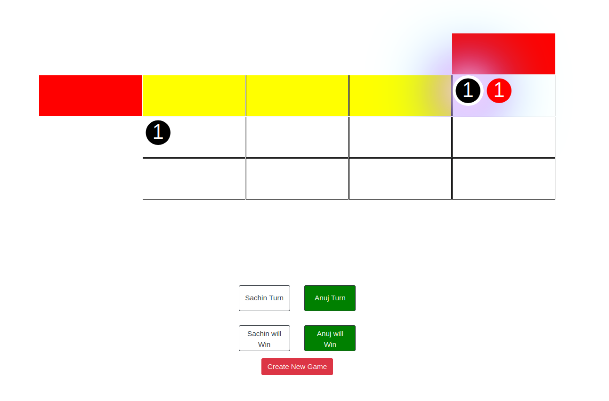
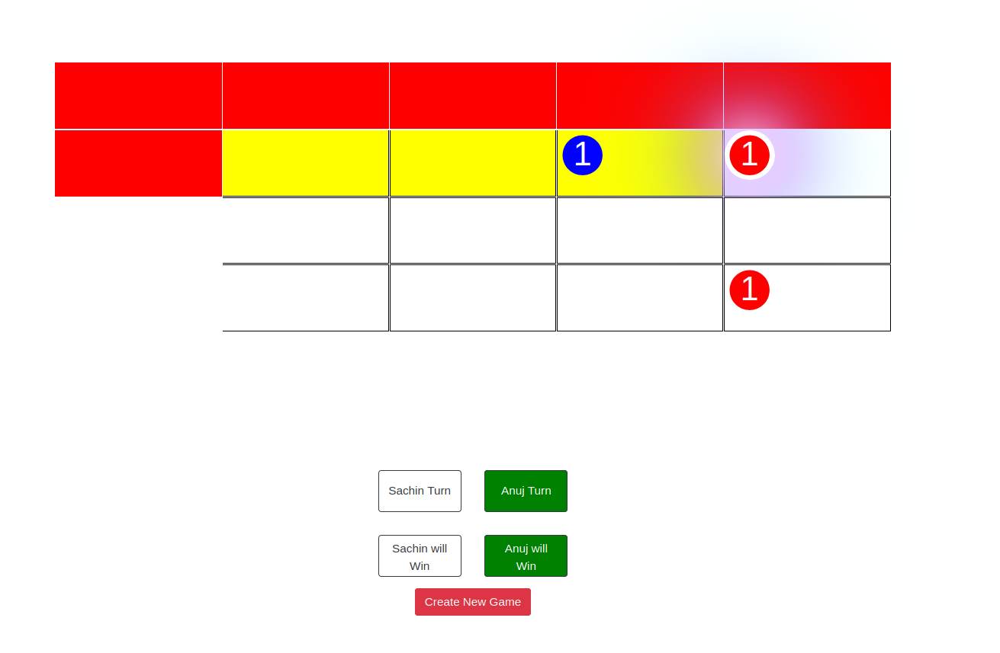
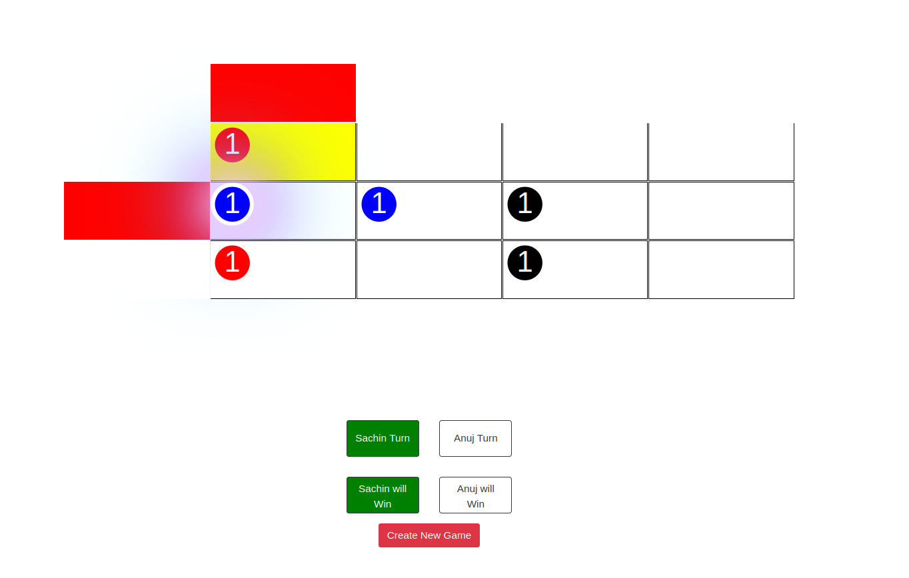

# kickOut Game

## Intro and Game Rules

KickOut is a game which I theorised, on a 3D plane. However for simplicity, I have implented it in on 2D board.
Some Rules of the Game are as follows

- The player to delete the last token/piece from the board wins the game.
- There are three types of pieces:
  - **Black**: Moves like a Rook in the chess game. Only difference here is that it can move only left or up, to ensure the finite moves in the game.
  - **Blue**: Moves like a Queen in the chess game. Again only difference here is that it can move only left or up or left-up diagnol.
  - **Red**: Can move anywhere in the upper-left subarray.
- Along, with moving a piece, any piece has a possibility of being thrown out (removed) of the board in a move.

## File Structure

```shell
.
├── css
│   ├── game.css
│   └── index.css
├── html
│   ├── create_game.html
│   └── game.html   # the main game page
├── index.html
├── js
│   ├── create_game.js
│   ├── create_hint.js
│   ├── manage_player_turn.js
│   ├── moving_pieces.js
│   ├── setup_board.js
│   └── win_predictor.js
├── README.md
└── screenshots
    ├── create_game.png
    ├── game1.png
    ├── game2.png
    ├── game3.png
    ├── game4.png
    └── main_menu.png
```

## WinPredictor and Hints

- The WinPredictor has been implemented based on the game theory concepts. Check out some of the basic theory here at [Sprague–Grundy theorem - Wikipedia](https://en.wikipedia.org/wiki/Sprague%E2%80%93Grundy_theorem) and [Grundy Numbers](https://en.wikipedia.org/wiki/Nimber).
- The main game logic for win prediction is written in 'win_predictor.js' in js folder.


## Screenshots
- Main Menu
     


- Create Game



- Game ScreenShots 
  
  
  
  
  

## Multiplayer Online Version:
Really excited to try this game and challenge your friends in online tournaments? Checkout the Multiplayer online version at: [Multiplayer Github Repo](https://github.com/yadav-sachin/kickOut).


